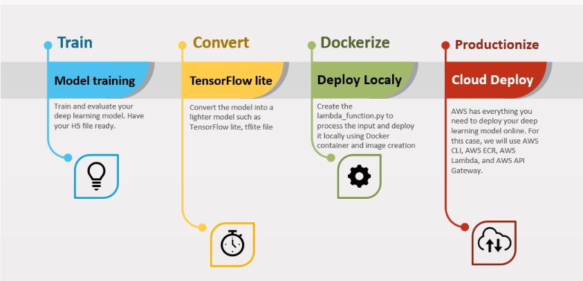

# deploy-image-classification-to-AWS-serverless
Deploy Serverless Image Classification on AWS - Deploy Deep Learning model using Docker, AWS Lambda, and API Gateway.

Background 
After you build and evaluate the model in the data science life cycle, it's time to create a complete solution that will provide value. 
To do just that we can deploy our model so that services and applications will be able to use it via REST API.

Model Conversion
Usually the model size will be very large and not optimized for production deployment as an API, especially for edge or mobile cases.

This is where we'll leverage TensorFlow Lite (TFLite). We are now going to create a more efficient format *.tflite - a binary sized model with low impact
on the model performance. 

load the model in the h5 file
Instantiate a TFLiteConverter object from a loaded trained model
Convert and save the converted model in tflite file format

Model Deployment
The model deployment focus on 4 main steps:

- Deploy the model into a Docker container and create a docker image locally
- Deploy the container image we created into AWS ECR (Elastic Container Registry)
- Create a lambda function to trigger the container and make the prediction
- Create API Gateway to allow interaction with the model
